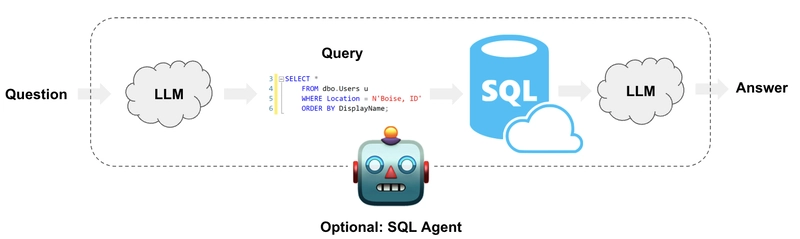

# Бот Ассистент для анализа рынка фриланса
## Сделан в архитектуре RAG Text2SQL Agent.

## Запуск
- Нужно устновить ollama с офф. сайта: "https://ollama.com/download" и запустить `ollama serve && ollama pull deepseek-r1 && ollama run deepseek-r1`
- `make po_install` - установить Poetry зависимости
- `make bot` - запустить бота в терминале
- `make help` - инф. по командам

### Технологии:
- Для `Text2SQL` используется `vanna.ai + deepseek r1` (о нём ниже).
- Для `SQL2Text` используется `ollama + meta-llama` (конечно, `ChatGPT` был бы в 110 раз лучше, но я ограничен технологиями своего времени). Однако `Deepseek` лучше всех из бесплатных моделей понимает (переводит) русский язык. Лучше из худших.
- Для БД выбрана `sqlite` (нет смысла стрелять по воробьям из пушки в контексте задачи).
- `Poetry` - для управления зависимостями (также выведен файл `requirements.txt`).

### Плюсы:
- У Vanna есть веб-приложение для обучения с подкреплением в браузере: `make vanna_app` -> `localhost:8084`.
- Собственно, дообучение модели `Vanna` (`LoRA`) (об этом ниже).
- Как я понял, это типовой подход к созданию ботов-помощников при работе с данными, которые занимаются анализом табличных данных. В целом это логично.

### Минусы:
- (`Vanna + Deepseek r1`) при генерации SQL очень плохо понимают соответствия русских слов ("а.л программист") и соответствующих значений в TEXT-колонках таблиц.
- Относительно долгое ожидание ответа. Возможно, `Ollama` неэффективна.
- Vanna использует `print` для логирования и не даёт отключить это поведение, поэтому немного "мусора" в терминале.
- Иногда на один и тот же вопрос может выдать как ошибку, так и нормальный результат. Нужно либо более серьезнное дообучение или исп. более продвинутую LLM модель.  

### Fine tuning
Тренировка модели на датасете `[<вопрос>-<соответствующее.sql>] ~ q.json`, который, кстати, сгенерирован с помощью `ChatGPT4`. В принципе, можно было бы ввести управление обучением через консольный флаг, но после первого прогона последующие становятся быстрее, так что я не стал этого делать.
P.S
Очень важно указать DDL определения таблицы. Есть [инф](https://arxiv-org.translate.goog/html/2408.04691v2?_x_tr_sl=en&_x_tr_tl=ru&_x_tr_hl=ru&_x_tr_pto=wapp). что с схемамаи Postgresql это бы работало лучше. Но по крайней мере благодаря конструкциям `CHECK` SQL-Agent не использует ерунду в TEXT-Column
### Идеи по улучшению
- Использовать `ChatGPT` вместо `Deepseek` и `Ollama`. :) `Ollama` иногда выводит "забугорные" буквы в stdout. Deepseek плохо понимает русский язык и структуру базы данных.

### Для проверки
Используйте ключевые вопросы из файла `q.txt`, которых нет в `q.json`.
